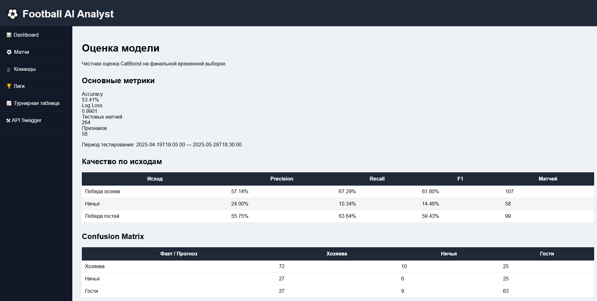
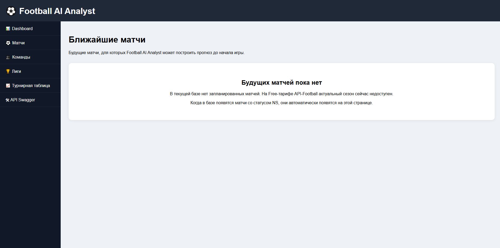

# Football AI Analyst

Football AI Analyst — система футбольной аналитики на Python, которая собирает данные матчей, рассчитывает статистические признаки, обучает модель CatBoost и прогнозирует исход футбольного матча.

Проект поддерживает:

* REST API;
* Web Dashboard;
* Telegram-бота;
* Explainable AI через SHAP;
* прогноз исторических и будущих матчей;
* временную проверку качества модели без утечки будущих данных.

---

## Статус проекта

Проект находится на этапе финализации **v1.0.0**.

Завершены:

* импорт футбольных данных;
* база данных;
* аналитические модули;
* Feature Engineering;
* обучение CatBoost;
* temporal validation;
* оптимизация CatBoost;
* честная оценка модели;
* прогноз будущих матчей;
* Explainable AI;
* REST API;
* Web Dashboard;
* Telegram-бот;
* основные автоматические тесты.

---

## Возможности

### Данные

Проект умеет работать с:

* лигами;
* сезонами;
* командами;
* матчами;
* статистикой матчей;
* турнирными таблицами;
* игроками;
* стадионами.

Основной источник данных:

```text
API-Football
```

---

## Аналитика

Реализованы анализаторы:

* форма команды;
* домашняя и гостевая форма;
* статистика команды;
* владение мячом;
* передачи;
* эффективность ударов;
* вратарская статистика;
* дни отдыха;
* стандартные положения;
* дисциплина;
* атакующее давление;
* оборонительное давление;
* серии результатов;
* очные встречи.

При построении ML-признаков используются только данные, доступные **до начала анализируемого матча**.

Это предотвращает data leakage.

---

## Machine Learning

Основная модель:

```text
CatBoostClassifier
```

Модель прогнозирует три исхода:

```text
H — победа хозяев
D — ничья
A — победа гостей
```

Файл модели:

```text
data/models/match_result_catboost.cbm
```

Список признаков:

```text
data/models/match_result_features.joblib
```

---

## Датасет

Текущий датасет:

```text
data/datasets/matches_dataset.csv
```

Размер:

```text
Матчей: 1756
Колонок: 65
Признаков модели: 58
```

Целевая переменная:

```text
result
```

---

## Честная оценка модели

Для финальной оценки используется **temporal split**, а не случайное перемешивание матчей.

Финальный тест:

```text
Матчей: 264
Период:
19.04.2025 19:05
—
29.05.2025 18:30
```

Основные метрики:

| Метрика  | Результат |
| -------- | --------: |
| Accuracy |    0.5341 |
| Log Loss |    0.9901 |

Baseline:

| Модель               |   Accuracy |
| -------------------- | ---------: |
| Всегда победа хозяев |     0.4053 |
| Самый частый класс   |     0.4053 |
| CatBoost             | **0.5341** |

Таким образом, CatBoost превосходит простой baseline примерно на **12.9 процентного пункта**.

---

## Метрики по исходам

| Исход             | Precision | Recall |     F1 | Матчей |
| ----------------- | --------: | -----: | -----: | -----: |
| Победа хозяев `H` |    0.5714 | 0.6729 | 0.6180 |    107 |
| Ничья `D`         |    0.2400 | 0.1034 | 0.1446 |     58 |
| Победа гостей `A` |    0.5575 | 0.6364 | 0.5943 |     99 |

Главное слабое место текущей модели — определение ничейных результатов.

---

## Confusion Matrix

```text
          predicted_H  predicted_D  predicted_A
actual_H           72           10           25
actual_D           27            6           25
actual_A           27            9           63
```

---

## Accuracy по лигам

| Лига           | Матчей |   Accuracy |
| -------------- | -----: | ---------: |
| Bundesliga     |     41 |     0.3902 |
| La Liga        |     66 |     0.5758 |
| Ligue 1        |     45 |     0.5333 |
| Premier League |     55 |     0.5273 |
| Serie A        |     57 | **0.5965** |

---

## Accuracy по уверенности модели

| Уверенность | Матчей |   Accuracy |
| ----------- | -----: | ---------: |
| Ниже 40%    |     31 |     0.4839 |
| 40–50%      |    100 |     0.4400 |
| 50–60%      |     71 |     0.5211 |
| 60% и выше  |     62 | **0.7258** |

При уверенности модели **60% и выше** Accuracy на финальной тестовой выборке составляет **72.58%**.

---

## Отчёт оценки

Полный машинно-читаемый отчёт сохраняется в:

```text
data/reports/model_evaluation.json
```

Запуск оценки:

```bash
python -m scripts.evaluate_model
```

---

## Explainable AI

Для объяснения прогнозов используются SHAP-значения CatBoost.

Система показывает:

* какие признаки поддерживают выбранный исход;
* какие признаки работают против него;
* значение признака;
* относительную важность фактора;
* текстовое объяснение прогноза.

Сервис:

```text
app/services/prediction_explanation_service.py
```

---

## REST API

Запуск:

```bash
uvicorn app.web_api:app --reload
```

Основные endpoints:

```text
GET /fixtures/latest
GET /fixtures/upcoming
GET /fixtures/search
GET /fixtures/{fixture_id}

GET /predict/{fixture_id}
```

Swagger:

```text
http://127.0.0.1:8000/docs
```

---

## Web Dashboard

Dashboard:

```text
http://127.0.0.1:8000/dashboard
```

Основные страницы:

```text
/dashboard
/dashboard/fixtures
/dashboard/upcoming
/dashboard/teams
/dashboard/leagues
/dashboard/standings
/dashboard/predict/{fixture_id}
/dashboard/model-evaluation
```

Dashboard позволяет:

* просматривать матчи;
* просматривать команды;
* просматривать лиги;
* просматривать турнирные таблицы;
* открывать прогноз матча;
* видеть вероятности H/D/A;
* видеть объяснение прогноза;
* просматривать реальные метрики модели;
* просматривать ближайшие будущие матчи.

---

## Прогноз будущего матча

`PredictionService` умеет строить прогноз без фактического результата матча.

Для будущего матча:

```text
home_goals = None
away_goals = None
```

не мешают построению:

* ML-признаков;
* вероятностей;
* итогового прогноза;
* SHAP-объяснения.

Получение ближайших матчей реализовано через:

```python
FixtureService.get_upcoming_matches()
```

---

## Telegram-бот

Запуск:

```bash
python -m scripts.run_bot
```

Основные команды:

```text
/start
/help
/predict <fixture_id>
/next
/cancel
```

`/next` показывает ближайшие будущие матчи.

При наличии матчей пользователь может выбрать матч и получить прогноз.

---

## Ограничение Free API-Football

Проект v1.0 разрабатывается на тарифе **Free API-Football**.

Free-тариф ограничивает доступ к актуальным сезонам.

Поэтому в текущей локальной базе нет реальных будущих матчей сезона 2026/27:

```text
NS матчей: 0
```

Это ограничение источника данных, а не архитектуры проекта.

При переходе на платный API-Football актуальные сезоны можно будет импортировать без изменения ML-архитектуры проекта.

---

## Обучение модели

```bash
python -m scripts.train_model
```

---

## Оптимизация CatBoost

```bash
python -m scripts.optimize_model
```

Результаты:

```text
data/reports/catboost_optimization_results.csv
```

---

## Сравнение моделей

```bash
python -m scripts.compare_models
```

Отчёт:

```text
data/reports/catboost_model_comparison.csv
```

---

## Экспорт датасета

```bash
python -m scripts.export_dataset
```

---

## Тесты

Проект содержит pytest-тесты для:

* `PredictionService`;
* `FeatureBuilder`;
* REST API прогноза;
* Dashboard;
* Explainable AI.

Запуск:

```bash
python -m pytest -v
```

Текущий результат:

```text
12 passed
```

---

## Проверка синтаксиса проекта

```bash
python -m compileall app scripts tests
```

---

## Технологии

* Python 3.12
* FastAPI
* SQLAlchemy
* Alembic
* SQLite
* pandas
* scikit-learn
* CatBoost
* joblib
* NumPy
* SHAP через CatBoost
* python-telegram-bot
* Jinja2
* loguru
* pytest

---

## Структура проекта

```text
app/
├── ai_agent/
├── analytics/
├── api/
├── bot/
├── core/
├── dashboard/
├── database/
├── importers/
├── ml/
├── models/
├── repositories/
├── scheduler/
├── schemas/
├── services/
└── utils/

scripts/
├── import_*.py
├── analyze_*.py
├── export_dataset.py
├── train_model.py
├── optimize_model.py
├── compare_models.py
├── evaluate_model.py
└── run_bot.py

tests/
├── test_dashboard_routes.py
├── test_feature_builder.py
├── test_prediction_api.py
├── test_prediction_explanation_service.py
└── test_prediction_service.py

data/
├── datasets/
├── models/
└── reports/
```

---

## Скриншоты

### Оценка модели



### Ближайшие матчи



---

## Безопасность

API-ключи и Telegram Bot Token должны храниться только в:

```text
.env
```

`.env` не должен попадать в Git.

Для публичного репозитория используется:

```text
.env.example
```

---

## Репозиторий

```text
https://github.com/stranik87/football-ai-analyst
```

---

## Версия

Подготавливаемый релиз:

```text
v1.0.0
```
